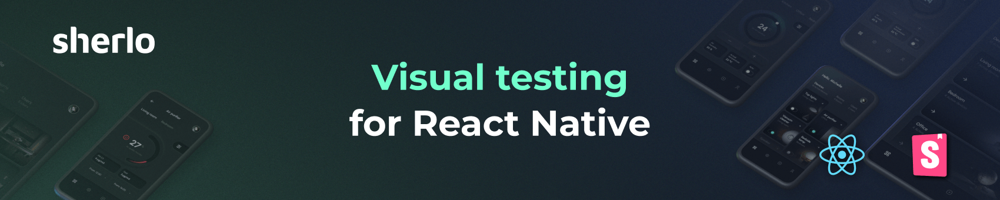

  

# Visual Testing for React Native Storybook

[Sherlo](https://sherlo.io) is an automated visual regression testing platform for React Native Storybook. It captures screenshots of your components on iOS and Android simulators in the cloud, detects visual changes, and surfaces them for team review.

## How it works

1. **📸 Capture** - Sherlo takes screenshots of your UI on iOS and Android simulators in the cloud
2. **🔍 Detect** - Visual changes are detected automatically against previous versions
3. **👍 Review** - Your team reviews detected changes before they go live

## Resources

- **Website** → [sherlo.io](https://sherlo.io)
- **Documentation** → [sherlo.io/docs](https://sherlo.io/docs)
- **Main repo** → [sherlo-io/sherlo](https://github.com/sherlo-io/sherlo)

## Community

- 💬 [Join our Discord](https://discord.gg/G7eqTBkWZt)
- 📢 [Follow us on X](https://x.com/sherlo_io)
- 📧 Questions? contact@sherlo.io
